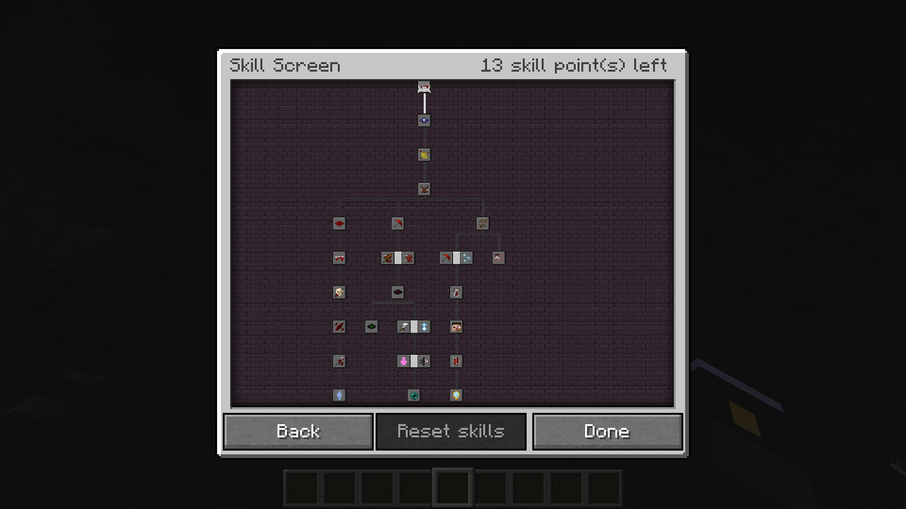

A skill tree is a collection of skill nodes that can be unlocked by skill points the player gets each level.




## Built-in Skill Trees
- `vampirism:vampire/level`
- `vampirism:vampire/lord`
- `vampirism:hunter/level`
- `vampirism:hunter/lord`

The both level skill trees are unlocked by joining the faction, while both lord skill trees are unlocked by reaching the first lord level of the faction.

## Creating a skill tree

A skill tree has the following structure:

```json title="data/<modid>/vampirism/skill_trees/<skill-tree-path>.json"
{
  "display": <item-stack>,
  "faction": {
    "id": "<faction-id>"
  },
  "name": <Component>,
  "unlock_predicate": <entity-predicate>,
}
```

| Field              | Type             | Description                                                            |
|--------------------|------------------|------------------------------------------------------------------------|
| `display`          | itemstack        | The item stack that is used to display the skill tree in the GUI.      |
| `faction`          | ResourceLocation | The faction the skill tree belongs to.                                 |
| `name`             | Component        | The display name of the skill tree.                                    |
| `unlock_predicate` | entity-predicate | The predicate that is used to determine if the skill tree is unlocked. |


### Example

```json title="data/vampirism/vampirism/skill_trees/vampire/lord.json"
{
  "display": {
    "Count": 1,
    "id": "vampirism:vampire_minion_binding"
  },
  "faction": {
    "id": "vampirism:vampire"
  },
  "name": {
    "translate": "text.vampirism.skills.lord"
  },
  "unlock_predicate": {
    "type_specific": {
      "type": "vampirism:faction",
      "faction": {
        "id": "vampirism:vampire"
      },
      "lord_level": 1
    }
  }
}
```

The vampire lord skill tree is unlocked when the player has the vampire faction and a minimum lord level of 1. With the Vampire Minion Binding as item and the translation of `text.vampirism.skills.lord` as name.