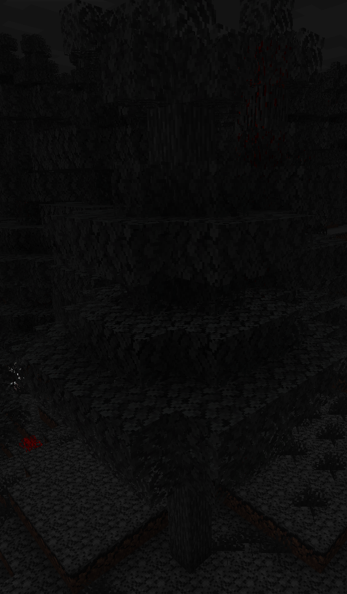

## Vampire Forest
The Vampire Forest is a biome that is completely covered in fog, so that vampires can move freely at daytime.

Because of the vampire friendly territory all vampire creatures feel at home especially the [Vampire Barons](./entities/baron) that only spawn in the forest.

## Flora
### Dark Spruce Tree

### Bloody Spruce Tree

### [Vampire Orchid](./blocks#vampire-orchid)

## Fauna

- [Vampire](./entities/vampire)
- [Vampire Baron](./entities/baron)
- [Blinding Bat](./entities/blinding_bat)
- [Vampiric Creature](./entities/bitten_animal)