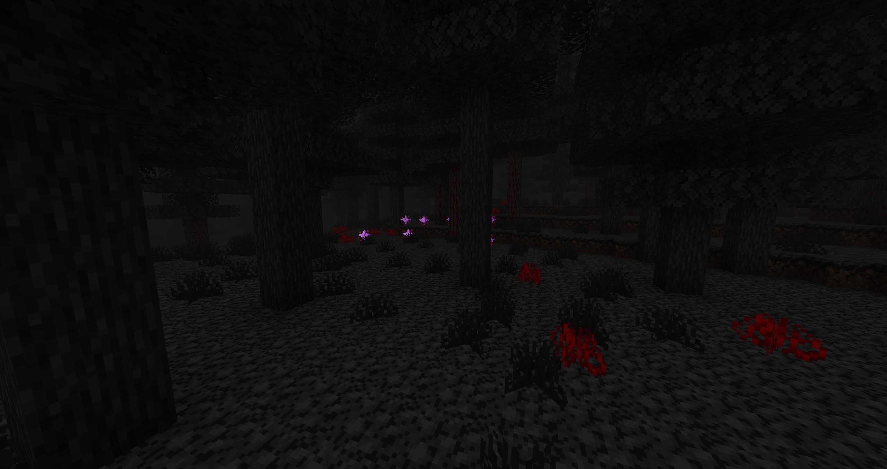
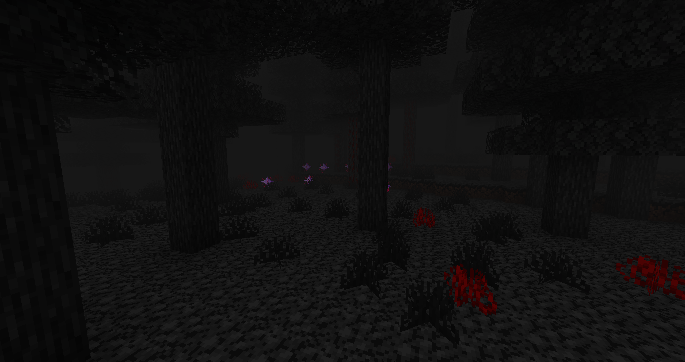
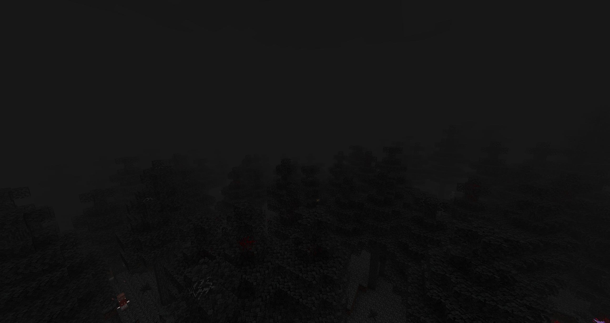
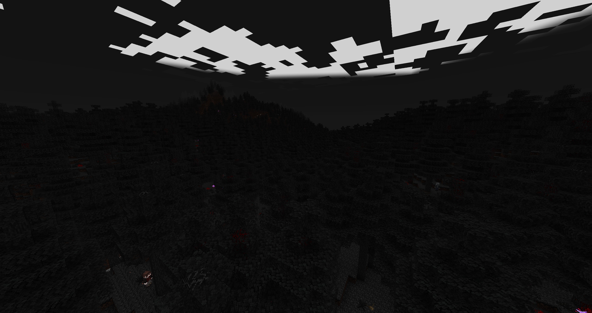
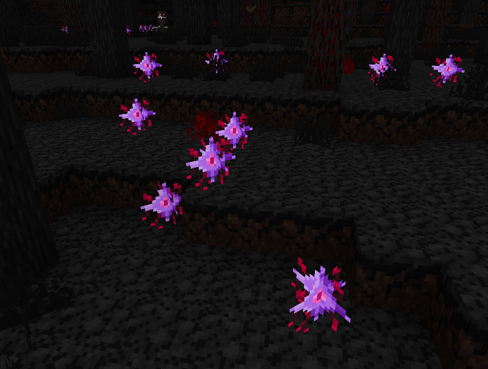
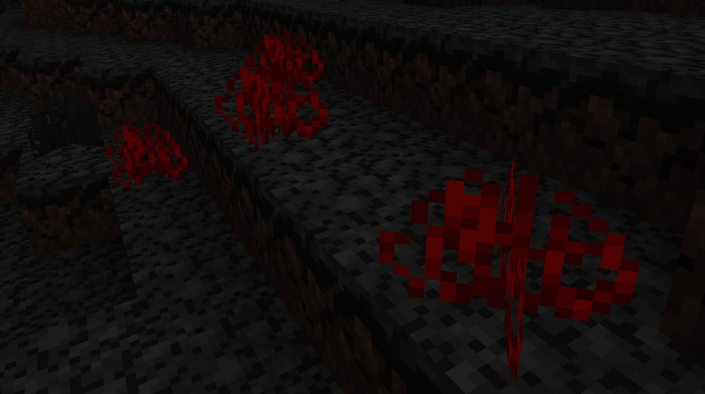

## Vampire Forest
The Vampire Forest is a biome that is completely shrouded in fog, so that vampires can move freely during the day. This fog makes it difficult to see into the distance.
While Vampires can see better though the fog, other player can only see a few meters away.

Because of the vampire friendly territory all vampire creatures feel at home especially the [Vampire Barons](./entities/baron) that only spawn in the forest.

## Flora
### Dark Spruce Tree

import darkSpruceTree from '../assets/biome/dark_spruce_tree.png';

### Cursed Spruce Tree

Easy to spot, the Cursed Spruce Tree has a reddish tone to it. This is caused by the surrounding biome.

The tree can be found with bark around it, which will pull non vampire entities towards the tree and will slowing suck their blood.

import cursedSpruceTree from '../assets/biome/cursed_spruce_tree.png';

### [Vampire Orchid](./blocks#vampire-orchid)

### Cursed Roots

## Fauna

- [Vampire](./entities/vampire)
- [Vampire Baron](./entities/baron)
- [Blinding Bat](./entities/blinding_bat)
- [Vampiric Creature](./entities/bitten_animal)