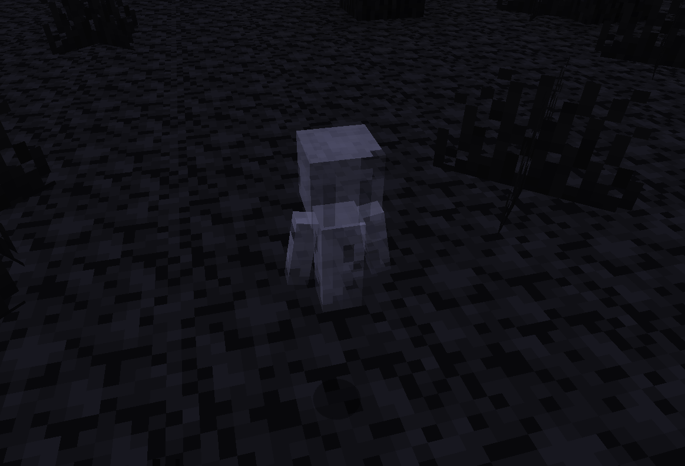

Ghosts are mysterious creatures that only appear near the [Ancient Remains](./ancient_remains). Ghosts seem only interested in protecting the [Ancient Remains](./ancient_remains).
They have no physical form, can fly through blocks and are invulnerable to several damage types.

