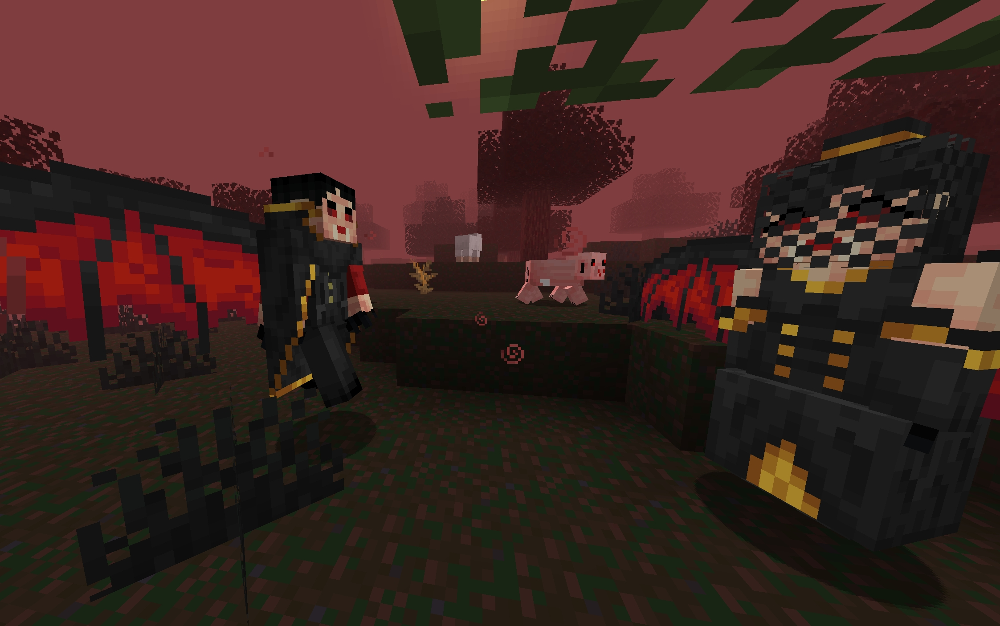
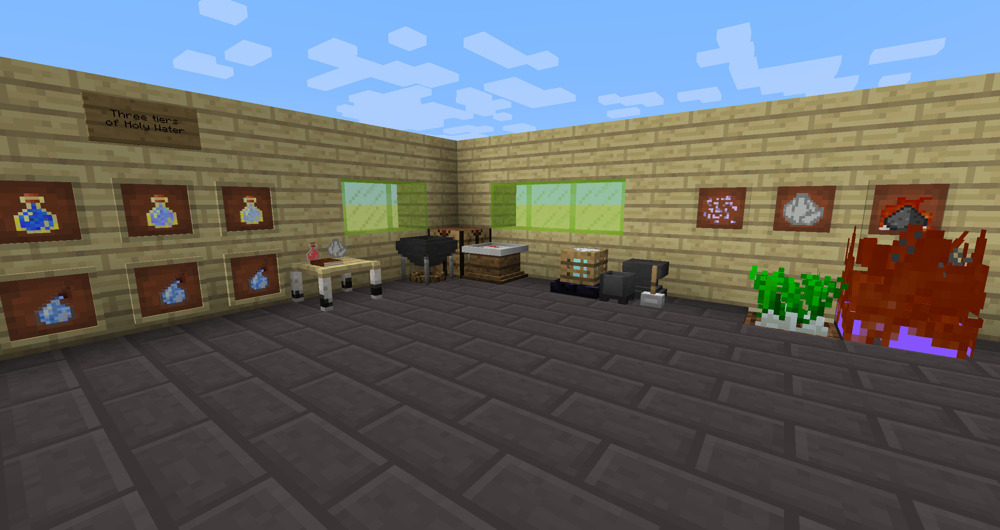

## General

The following is supposed to give you an quick overview over the major features of Vampirism.  
There are small features, adjustments or tweaks which are not mentioned here (advancements, loot generation, mob interaction and much more).

### Mobs

Vampire mobs spawn in the same biomes zombies spawn. They are night active and hunt for non-vampire players. They also occasionally suck blood from animals.  
The basic vampires have different levels which affect their health as well as damage. Their level is chosen based on the levels of nearby players when they are spawned.  
Moreover, there are advanced vampires, which are even stronger, but drop better loot. Sometimes normal vampires follow them.  
They are named after people who contributed to this mod. 

Vampire hunter spawn in small camps generated around the world. They hunt vampires, but usually stay close to their tent.  
They also spawn in different levels and sometimes there is an advanced hunter in the camp.

Vampire barons appear in the vampire forest. They are very strong and grow fangs when angered. 
They do not like other powerful vampires in their territory, so they attack vampire players and other barons.

In the vampire forest there are vampire versions of the vanilla mobs.  
If you suck all of a creature's blood it might also turn into a vampire version.  

### Village

Villages play an important role in Vampirism, since there are many blood-rich villagers there.  
Vampirism (slightly) increases the density and size of villages in the world.  

Villagers can be captured and controlled by vampires or hunters. The controlling faction will have benefits in the village like fog to prevent sun damage or better trades.

### Configuration

Many aspects of the game are configurable. Instead of modifying the configuration files you can also use the ingame menu (Only in Minecraft 1.12).  
Almost all balance related values are configurable in the balance section. For more information see here: https://github.com/TeamLapen/Vampirism/wiki/Configuration

### Items and Blocks

## Vampires
### Skills

Vampire players can unlock many different skills after leveling up.

Some of the skills allow the player to use certain actions like turning into a bat or disguising as a normal human or turning invisible.
### Blocks and items

There are different blocks allowing vampires to collect, store and use their blood.

Dyeable coffins allow vampire players to sleep with style during the day.

Some weapons specifically crafted for vampires can be charged with blood to improve their damage. However, players have to train with them to be able to use them perfectly.
### Rituals

Altars allow vampires to perform rituals to level up. Depending on the level the requirements change.

## Hunter
### Skills

Hunter player can unlock many different skills after leveling up to not give them more means to defeat the vampires but also to make themselves stronger.  

### Blocks and items

There are several blocks enabling hunter players to craft better weapons, brew special potions or keep vampires away. However, they have to learn how to use them first.

Some of the new weapons are these crossbows, which are available in different variants and with different arrow types.

Special weapons are especially powerful against vampires.

There are three different new armor types for hunter. They all come in three tiers. The middle tier is more difficult and expensive to craft. The highest one can only be find in loot chests around the world.

### Leveling

A special chair can be found alongside a trainer in a special village building. These are required for leveling up as a hunter.

## Lord and Minions

After reaching the highest level as vampire or hunter you can become a vampire lord or a master hunter and obtain different ranks. Therefore, they must complete tasks for a vampire/hunter faction representative.

The higher your rank, the more minions you can control. Minions can be equipped with weapons and armor, store items in their inventory and be leveled up. You can give your minions various tasks like defend an area, collect resources or follow you.

