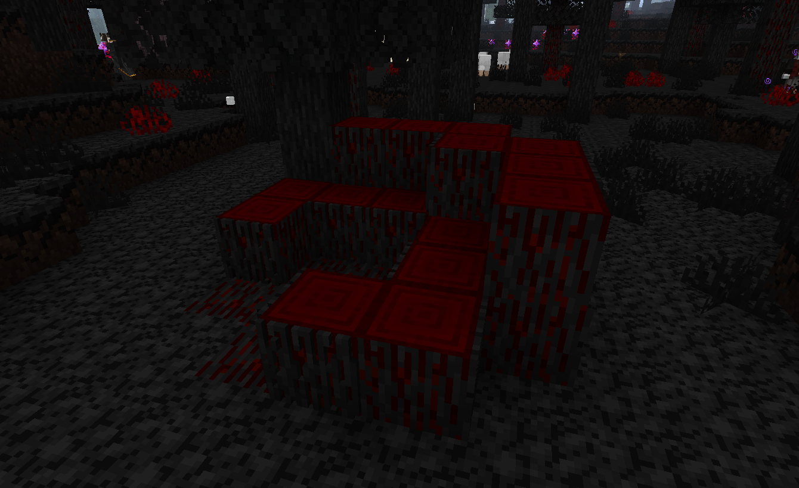
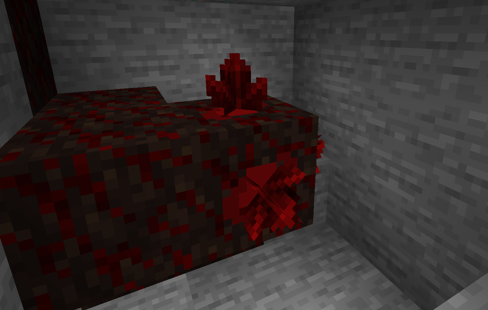

The Ancient Remains is a boss that can be found in the [Vampire Forest](../biomes#vampire-forest). It is not a typical boss fight as it is not an entity, but a structure, specifically a collection of blocks. To defeat the Ancient Remains, you must destroy all vulnerabilities, but make sure to protect yourself, the Ancient Remains ist not defenseless.

Below the surface structure you will find a root network that connects into the ground.

## Fight

### Start
Once a player is in the vicinity of the Ancient Remains, they will see the boss bar of the Ancient Remains and the Ancient Remains will start to drain the players' food / blood. As long as you are in the direct vicinity of the Ancient Remains, [Ghost](./ghost) will spawn and attack you.

### Progress the fight

The Ancient Remains root network has some weak points along its path. These vulnerabilities must be destroyed to defeat the Ancient Remains. The vulnerabilities will defend themselves by using crystals to attack the player.

Once a vulnerability is destroyed, the Ancient Remains will shield itself for a short time. This will result in spawning a few [Ghosts](./ghost) and making the vulnerabilities invulnerable. The shield will disappear after a short time, and the vulnerabilities will be vulnerable again.
### End
When all vulnerabilities are destroyed, the Ancient Remains will fall apart and reveal a central block. If destroyed, it drops the loot of the boss fight

## Loot
- Mother Core
- Ancient Trophy