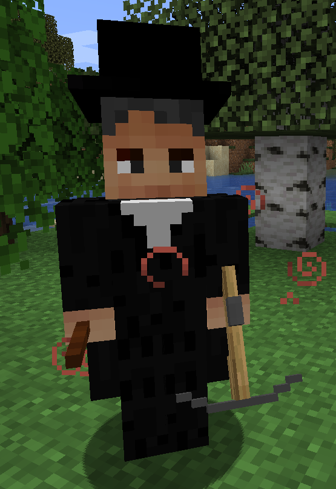
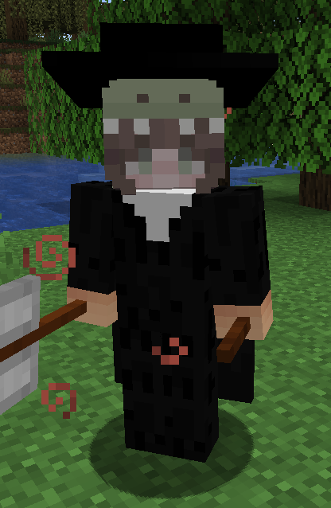

## Basic Hunter

Basic Hunters are the normal type of hunters that can be encountered in the game. They can either attack melee or ranged with a crossbow.

### Appearance

Hunters have multiple textures.

### Drops

- [Human Heart](../items.mdx#human-heart)
- [Holy Salt](../items.mdx#holy-salt)
- [Vampire Accessories](../items.mdx#accessories)

### Spawning
- Hunter Camps

## Advanced Hunter

Advanced Hunters are stronger and more dangerous than the basic Hunters.
### Appearance

They have a name tag and a custom face.

### Drops

- [Vampire Blood](../items.mdx#vampire-blood)
- [Garlic](../items.mdx#garlic)
- [Holy Water](../items.mdx#holy-water)
- [Holy Salt](../items.mdx#holy-salt)
- [Vampire Book](../items.mdx#vampire-book)

### Spawning
- Advanced Hunter Camps