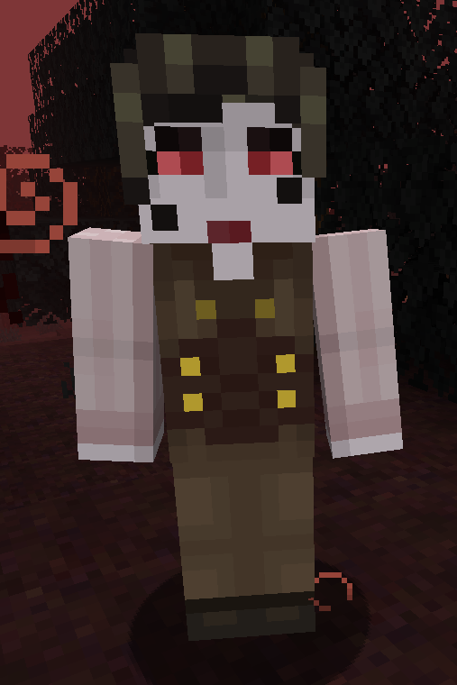
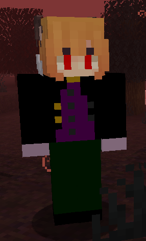

## Basic Vampire

Basic Vampires are the normal type of hunters that can be encountered in the game.

### Appearance

Vampires have multiple textures.

### Drops
- [Vampire Fang](../items.mdx#vampire-fang)
- [Vampire Blood](../items.mdx#vampire-blood)
- [Vampire Accessories](../items.mdx#accessories)
### Spawning
- [Vampire Forest](../biomes.md#vampire-forest)
- rarely in all biomes

## Advanced Vampire

Advanced Vampire are stronger and more dangerous than the basic Vampire.

### Appearance

Advanced Vampire have a name tag and a custom face.

### Drops
- [Blood Bottles](../items.mdx#blood-bottle)
- [Vampire Books](../items.mdx#vampire-book)
- [Vampire Blood](../items.mdx#vampire-blood)
- [Vampire Accessories](../items.mdx#accessories)

### Spawning
- rarely in all biomes