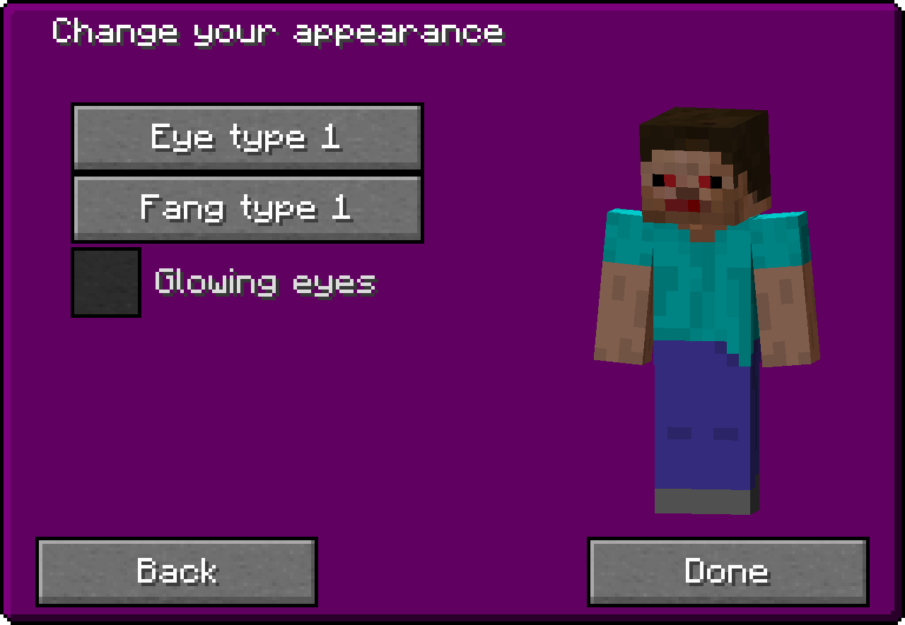

You can configure the appearance of your vampire player model in the Vampire Appearance Screen or by [commands](../../commands#appearance-commands).

You can configure the following:
- Eye overlay
- Fang overlay
- Glowing eye overlay
- Lord title gender (only by command)

## Appearance Screen

It can be opened from the Vampirism Menu by clicking this button:

